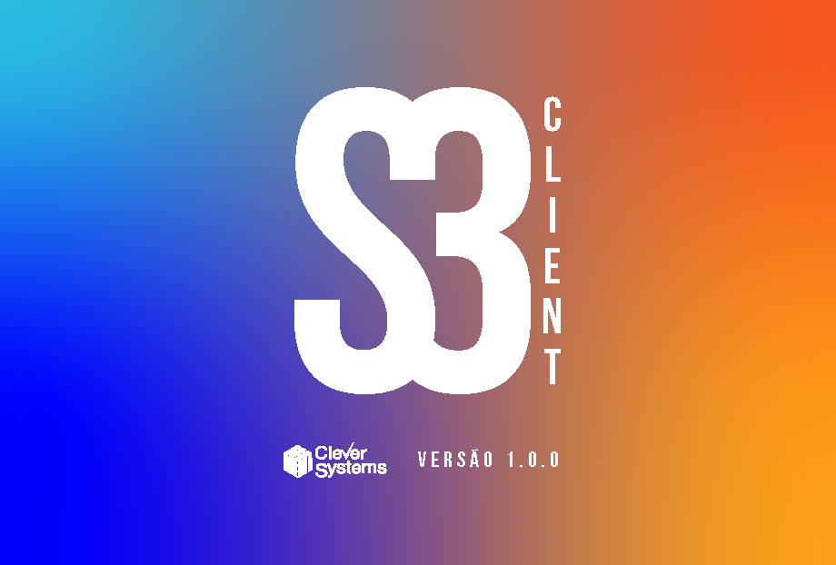

# S3-client


<br>

## About The Project
***

O S3 é a nova plataforma client para realizar chamadas de senhas no sistema de senhas S3

### Built With

Para o desenvolvimento do projeto foram usados os seguintes pacotes com seus sub pacotes:
* [NodeJS](https://nodejs.dev)
* [Electron](https://www.electronjs.org)
* [TypeScript](https://www.typescriptlang.org)
* [VSCode](https://code.visualstudio.com)

## Prerequisites
***
Antes de começar, verifique se você atendeu aos seguintes requisitos:
<!---Estes são apenas requisitos de exemplo. Adicionar, duplicar ou remover conforme necessário--->
* Você instalou a versão mais recente do `<NodeJS>`
* Você necessita ter uma máquina com o sistema operacional `<Windows / Linux>`. Essa aplicação não suporta `<Mac>`.

## Getting Started
***

### Installation:
1. Clone o repositório
```sh
git clone https://github.com/CleverSystemsLTDA/s3-client.git
```
2. Instale os pacotes de dependencias:
```sh
npm install
```
3. Construa o projeto
```sh
npm run build:backend
```

### Usage:
#### Rode ou construa um executável:
**Rodar:**
1. Execute
```sh
npm run electron
```

**Construir executável**
1. Execute
```sh
npm run dist
```

2. Acesse a pasta /dist para ter aceso ao executável

[⬆ Voltar ao topo](#nome-do-projeto)<br>


